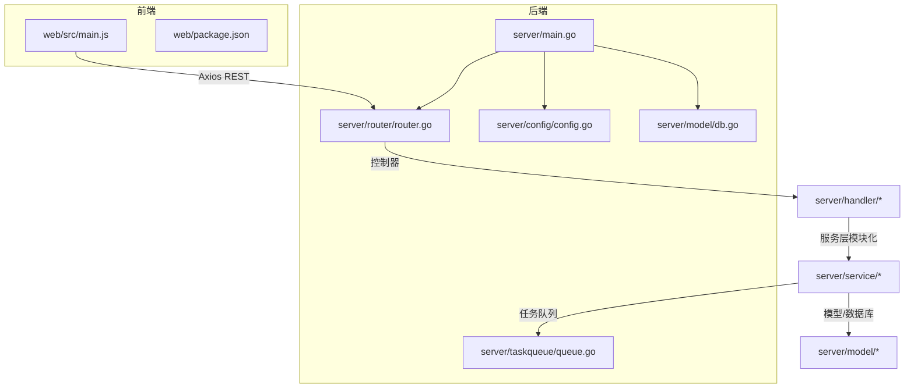
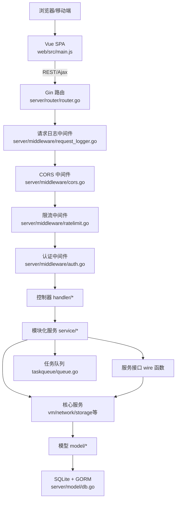
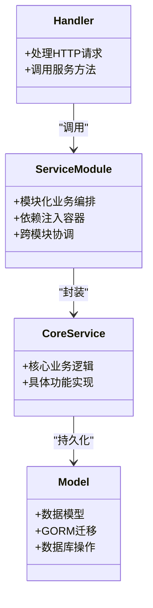
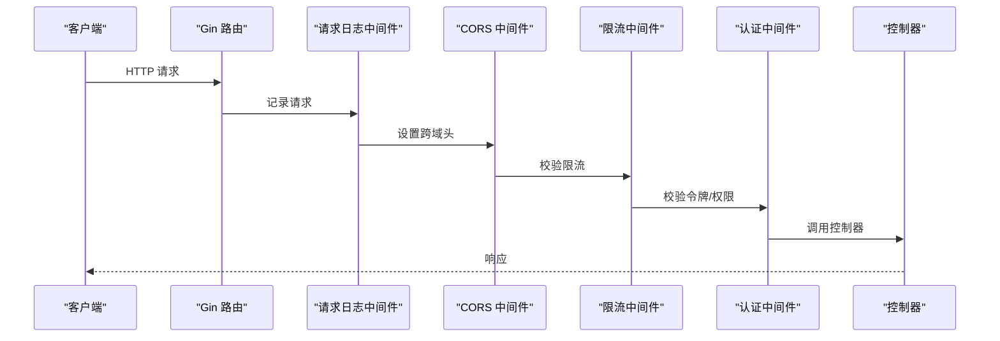
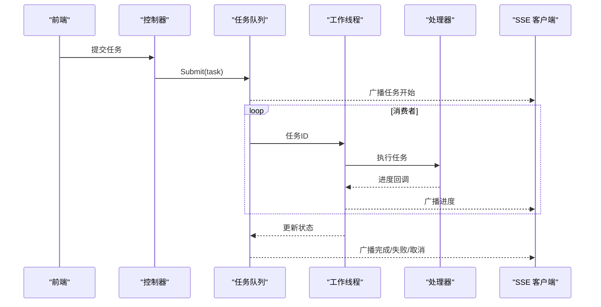
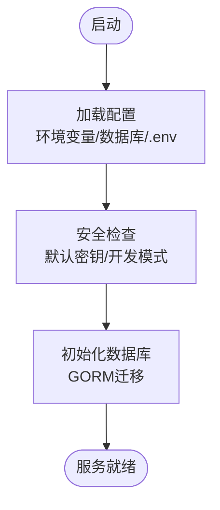
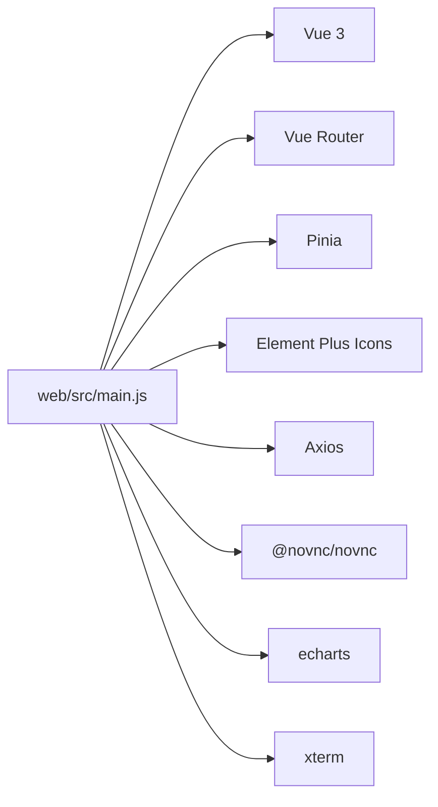
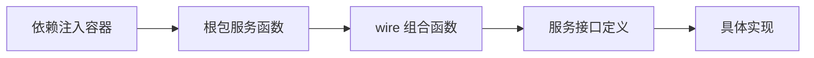

# 系统架构

<cite>
**本文引用的文件**
- [server/main.go](file://server/main.go)
- [server/router/router.go](file://server/router/router.go)
- [server/middleware/auth.go](file://server/middleware/auth.go)
- [server/middleware/cors.go](file://server/middleware/cors.go)
- [server/middleware/ratelimit.go](file://server/middleware/ratelimit.go)
- [server/middleware/request_logger.go](file://server/middleware/request_logger.go)
- [server/taskqueue/queue.go](file://server/taskqueue/queue.go)
- [server/config/config.go](file://server/config/config.go)
- [server/model/db.go](file://server/model/db.go)
- [server/service/vm/deps.go](file://server/service/vm/deps.go)
- [server/service/network/deps.go](file://server/service/network/deps.go)
- [server/service/storage/pool/config.go](file://server/service/storage/pool/config.go)
- [server/service/firewall/deps.go](file://server/service/firewall/deps.go)
- [server/service/host/deps.go](file://server/service/host/deps.go)
- [server/service/lightweight/deps.go](file://server/service/lightweight/deps.go)
- [server/service/public_ip/deps.go](file://server/service/public_ip/deps.go)
- [server/service/security/deps.go](file://server/service/security/deps.go)
- [server/service/template/deps.go](file://server/service/template/deps.go)
- [server/service/user/deps.go](file://server/service/user/deps.go)
- [server/service/vm_compat.go](file://server/service/vm_compat.go)
- [server/service/vm_register.go](file://server/service/vm_register.go)
- [web/src/main.js](file://web/src/main.js)
- [web/package.json](file://web/package.json)
</cite>

## 目录
1. [简介](#简介)
2. [项目结构](#项目结构)
3. [核心组件](#核心组件)
4. [架构总览](#架构总览)
5. [详细组件分析](#详细组件分析)
6. [模块化架构与依赖注入](#模块化架构与依赖注入)
7. [循环依赖解耦机制](#循环依赖解耦机制)
8. [依赖关系分析](#依赖关系分析)
9. [性能考量](#性能考量)
10. [故障排查指南](#故障排查指南)
11. [结论](#结论)

## 简介
本系统是一个基于 Go 语言的虚拟机管理控制台，采用前后端分离架构：
- 前端：Vue 3 + Element Plus 单页应用（SPA），通过 Axios 发起 REST 请求
- 后端：Gin Web 服务器，提供 REST API 和静态资源服务
- 数据层：SQLite + GORM
- 虚拟化基础设施：libvirt（通过 go-libvirt RPC 或 virsh 命令行）

系统采用模块化分层架构（控制器-服务-模型）与中间件体系，结合任务队列实现异步处理，支持认证、CORS、限流等横切关注点。经过重构后，服务层实现了完全的模块化架构，消除了循环依赖问题，提升了系统的可维护性和可扩展性。

## 项目结构
- server：后端服务
  - config：全局配置管理
  - router：路由与中间件装配
  - middleware：认证、CORS、限流、请求日志等中间件
  - handler：HTTP 控制器层，负责请求解析与响应
  - service：业务服务层，采用模块化架构，包含多个功能子模块
    - bandwidth：带宽管理模块
    - clone：虚拟机克隆模块
    - firewall：防火墙管理模块
    - guest_agent：来宾代理模块
    - host：主机管理模块
    - ip_resolver：IP解析模块
    - libvirt_rpc：libvirt远程调用模块
    - lightweight：轻量级云模块
    - network：网络管理模块
    - ovs：Open vSwitch模块
    - public_ip：公网IP模块
    - rescue：救援模式模块
    - scheduler：调度器模块
    - security：安全模块
    - share：共享模块
    - snapshot：快照模块
    - storage：存储管理模块
    - template：模板管理模块
    - traffic：流量统计模块
    - user：用户管理模块
    - vm：虚拟机管理模块
    - vm_xml：虚拟机XML处理模块
    - vnc：VNC控制模块
  - model：数据模型与数据库初始化
  - taskqueue：任务队列与 SSE 事件
  - logger：日志系统
  - utils：通用工具
- web：前端源代码
  - src：Vue 应用源码
  - package.json：依赖与脚本
- 其他：构建脚本、安装脚本、GitHub Actions 工作流等



**图表来源**
- [server/main.go:30-120](file://server/main.go#L30-L120)
- [server/router/router.go:18-485](file://server/router/router.go#L18-L485)
- [web/src/main.js:1-26](file://web/src/main.js#L1-26)

**章节来源**
- [server/main.go:30-120](file://server/main.go#L30-L120)
- [server/router/router.go:18-485](file://server/router/router.go#L18-L485)
- [web/src/main.js:1-26](file://web/src/main.js#L1-26)
- [web/package.json:1-30](file://web/package.json#L1-L30)

## 核心组件
- Gin Web 服务器与路由系统：统一入口、中间件链、静态资源服务
- 中间件体系：认证、CORS、限流、请求日志
- 任务队列与 SSE：异步任务处理与进度推送
- 配置系统：环境变量驱动的可持久化配置
- 数据库层：SQLite + GORM，自动迁移与兼容性处理
- 服务层：模块化业务编排与跨模块依赖注入
- 前端应用：Vue 3 + Element Plus，Axios 与 Pinia 状态管理

**章节来源**
- [server/router/router.go:18-485](file://server/router/router.go#L18-L485)
- [server/middleware/auth.go:75-199](file://server/middleware/auth.go#L75-L199)
- [server/middleware/cors.go:7-24](file://server/middleware/cors.go#L7-L24)
- [server/middleware/ratelimit.go:173-197](file://server/middleware/ratelimit.go#L173-L197)
- [server/taskqueue/queue.go:173-354](file://server/taskqueue/queue.go#L173-L354)
- [server/config/config.go:157-249](file://server/config/config.go#L157-L249)
- [server/model/db.go:57-113](file://server/model/db.go#L57-L113)
- [server/service/vm/deps.go:17-176](file://server/service/vm/deps.go#L17-L176)
- [web/src/main.js:1-26](file://web/src/main.js#L1-26)

## 架构总览
系统采用模块化的三层架构：
- 表现层（前端）：Vue SPA，通过 Axios 与后端 API 通信
- 控制器层（后端）：Gin 路由与中间件，处理请求与响应
- 服务层（后端）：模块化业务逻辑封装，协调模型与外部系统
- 数据层（后端）：SQLite + GORM，提供持久化能力



**图表来源**
- [server/router/router.go:18-485](file://server/router/router.go#L18-L485)
- [server/middleware/auth.go:75-199](file://server/middleware/auth.go#L75-L199)
- [server/middleware/cors.go:7-24](file://server/middleware/cors.go#L7-L24)
- [server/middleware/ratelimit.go:173-197](file://server/middleware/ratelimit.go#L173-L197)
- [server/taskqueue/queue.go:173-354](file://server/taskqueue/queue.go#L173-L354)
- [server/model/db.go:57-113](file://server/model/db.go#L57-L113)

## 详细组件分析

### 分层架构与控制器-服务-模型
- 控制器层（handler）：接收请求、参数校验、调用服务、返回响应
- 服务层（service）：模块化封装业务规则、跨模块协作、依赖注入容器
- 模型层（model）：数据结构、GORM 模型、数据库迁移与兼容性



**图表来源**
- [server/service/vm/deps.go:17-176](file://server/service/vm/deps.go#L17-L176)
- [server/model/db.go:57-113](file://server/model/db.go#L57-L113)

**章节来源**
- [server/service/vm/deps.go:17-176](file://server/service/vm/deps.go#L17-L176)
- [server/model/db.go:57-113](file://server/model/db.go#L57-L113)

### 中间件系统
- 认证中间件：支持 JWT 与 API Key，角色与权限校验
- CORS 中间件：跨域资源共享配置
- 限流中间件：基于滑动窗口的 IP 级限频
- 请求日志中间件：统一记录请求与响应



**图表来源**
- [server/router/router.go:18-485](file://server/router/router.go#L18-L485)
- [server/middleware/auth.go:75-199](file://server/middleware/auth.go#L75-L199)
- [server/middleware/cors.go:7-24](file://server/middleware/cors.go#L7-L24)
- [server/middleware/ratelimit.go:173-197](file://server/middleware/ratelimit.go#L173-L197)

**章节来源**
- [server/middleware/auth.go:75-199](file://server/middleware/auth.go#L75-L199)
- [server/middleware/cors.go:7-24](file://server/middleware/cors.go#L7-L24)
- [server/middleware/ratelimit.go:173-197](file://server/middleware/ratelimit.go#L173-L197)

### 任务队列与异步处理
- 任务提交：Submit/SubmitWithStruct
- 任务执行：多消费者 worker，按任务类型分派处理器
- 进度回调：SSE 广播，支持取消
- 自动清理：24 小时过期清理



**图表来源**
- [server/taskqueue/queue.go:173-354](file://server/taskqueue/queue.go#L173-L354)
- [server/main.go:130-800](file://server/main.go#L130-L800)

**章节来源**
- [server/taskqueue/queue.go:173-354](file://server/taskqueue/queue.go#L173-L354)
- [server/main.go:130-800](file://server/main.go#L130-L800)

### 配置系统与数据库初始化
- 配置加载：环境变量优先，支持 .env 文件同步
- 数据库初始化：SQLite + GORM，自动迁移与兼容性修复
- 安全检查：默认密钥检测与开发模式提示



**图表来源**
- [server/config/config.go:157-249](file://server/config/config.go#L157-L249)
- [server/config/config.go:251-283](file://server/config/config.go#L251-L283)
- [server/model/db.go:57-113](file://server/model/db.go#L57-L113)

**章节来源**
- [server/config/config.go:157-249](file://server/config/config.go#L157-L249)
- [server/config/config.go:251-283](file://server/config/config.go#L251-L283)
- [server/model/db.go:57-113](file://server/model/db.go#L57-L113)

### 前端架构与集成
- 应用入口：Vue 3 + Element Plus + Vue Router + Pinia
- 依赖：axios、@novnc/novnc、echarts、xterm 等
- 与后端集成：通过 Axios 发起 REST 请求，SSE 实时任务进度



**图表来源**
- [web/src/main.js:1-26](file://web/src/main.js#L1-26)
- [web/package.json:11-24](file://web/package.json#L11-L24)

**章节来源**
- [web/src/main.js:1-26](file://web/src/main.js#L1-26)
- [web/package.json:11-24](file://web/package.json#L11-L24)

## 模块化架构与依赖注入

### 服务层模块化设计
系统的服务层已完全重构为模块化架构，每个功能领域都有独立的包结构：

- **核心模块**：vm、network、storage、template、user 等主要业务模块
- **辅助模块**：firewall、security、traffic、scheduler 等支撑功能模块
- **接口模块**：各模块通过 wire 函数进行依赖注入和组合

```mermaid
graph TB
subgraph "服务层模块化架构"
VM["vm 模块<br/>虚拟机管理"]
NET["network 模块<br/>网络管理"]
STORAGE["storage 模块<br/>存储管理"]
TEMPLATE["template 模块<br/>模板管理"]
USER["user 模块<br/>用户管理"]
SECURITY["security 模块<br/>安全管理"]
FIREWALL["firewall 模块<br/>防火墙管理"]
TRAFFIC["traffic 模块<br/>流量统计"]
SCHEDULER["scheduler 模块<br/>调度器"]
END
VM --> VM_DEPS["vm/deps.go"]
NET --> NET_DEPS["network/deps.go"]
STORAGE --> STORAGE_DEPS["storage/pool/config.go"]
TEMPLATE --> TEMPLATE_DEPS["template/deps.go"]
USER --> USER_DEPS["user/deps.go"]
SECURITY --> SECURITY_DEPS["security/deps.go"]
FIREWALL --> FIREWALL_DEPS["firewall/deps.go"]
TRAFFIC --> TRAFFIC_DEPS["traffic/deps.go"]
SCHEDULER --> SCHEDULER_DEPS["scheduler/deps.go"]
```

**图表来源**
- [server/service/vm/deps.go:17-176](file://server/service/vm/deps.go#L17-L176)
- [server/service/network/deps.go:12-135](file://server/service/network/deps.go#L12-L135)
- [server/service/storage/pool/config.go:13-95](file://server/service/storage/pool/config.go#L13-L95)
- [server/service/template/deps.go:6-80](file://server/service/template/deps.go#L6-L80)
- [server/service/user/deps.go:15-120](file://server/service/user/deps.go#L15-L120)
- [server/service/security/deps.go:1-100](file://server/service/security/deps.go#L1-L100)
- [server/service/firewall/deps.go:1-80](file://server/service/firewall/deps.go#L1-L80)
- [server/service/traffic/deps.go:1-60](file://server/service/traffic/deps.go#L1-L60)
- [server/service/scheduler/deps.go:1-40](file://server/service/scheduler/deps.go#L1-L40)

**章节来源**
- [server/service/vm/deps.go:17-176](file://server/service/vm/deps.go#L17-L176)
- [server/service/network/deps.go:12-135](file://server/service/network/deps.go#L12-L135)
- [server/service/storage/pool/config.go:13-95](file://server/service/storage/pool/config.go#L13-L95)
- [server/service/template/deps.go:6-80](file://server/service/template/deps.go#L6-L80)
- [server/service/user/deps.go:15-120](file://server/service/user/deps.go#L15-L120)
- [server/service/security/deps.go:1-100](file://server/service/security/deps.go#L1-L100)
- [server/service/firewall/deps.go:1-80](file://server/service/firewall/deps.go#L1-L80)
- [server/service/traffic/deps.go:1-60](file://server/service/traffic/deps.go#L1-L60)
- [server/service/scheduler/deps.go:1-40](file://server/service/scheduler/deps.go#L1-L40)

### 依赖注入容器
服务层通过依赖注入容器实现松耦合的模块组合：

- **根包函数**：提供核心服务实例的创建和管理
- **wire 函数**：将各个模块的服务组合成完整的业务功能
- **接口抽象**：通过接口定义服务契约，便于测试和替换



**章节来源**
- [server/service/vm/deps.go:17-176](file://server/service/vm/deps.go#L17-L176)
- [server/service/network/deps.go:12-135](file://server/service/network/deps.go#L12-L135)
- [server/service/vm_register.go:171-220](file://server/service/vm_register.go#L171-L220)

## 循环依赖解耦机制

### Hook 变量模式
为了解决模块间的循环依赖问题，系统采用了 Hook 变量模式：

- **Hook 变量声明**：在子包的 deps.go 文件中声明 Hook 变量
- **延迟绑定**：通过 Hook 变量在运行时绑定到根包函数
- **避免导入循环**：子包不直接导入根包，而是通过 Hook 变量间接调用

```mermaid
graph TB
subgraph "循环依赖解耦示例"
SubPackage["子包如 network/firewall"]
HookVar["Hook 变量deps.go"]
RootPackage["根包服务函数"]
ExternalCall["外部函数调用"]
End
SubPackage --> HookVar
HookVar --> RootPackage
RootPackage --> ExternalCall
```

**图表来源**
- [server/service/network/deps.go:11-135](file://server/service/network/deps.go#L11-L135)
- [server/service/firewall/deps.go:2-80](file://server/service/firewall/deps.go#L2-L80)
- [server/service/security/deps.go:1-100](file://server/service/security/deps.go#L1-L100)

### 具体实现模式
不同类型的模块采用了相应的解耦策略：

- **网络相关模块**：通过 Hook 变量调用根包的网络服务函数
- **安全相关模块**：声明 Hook 变量避免反向导入根包
- **模板相关模块**：使用 Hook 变量处理外部依赖关系

**章节来源**
- [server/service/network/deps.go:11-135](file://server/service/network/deps.go#L11-L135)
- [server/service/firewall/deps.go:2-80](file://server/service/firewall/deps.go#L2-L80)
- [server/service/security/deps.go:1-100](file://server/service/security/deps.go#L1-L100)
- [server/service/template/deps.go:6-80](file://server/service/template/deps.go#L6-L80)

### 兼容性适配层
为了保持向后兼容性，系统还提供了兼容性适配层：

- **类型镜像**：在 vm_compat.go 中定义镜像类型
- **包装器函数**：通过 vm_register.go 中的包装器转换类型
- **渐进式迁移**：允许逐步替换旧的类型定义

**章节来源**
- [server/service/vm_compat.go:26-70](file://server/service/vm_compat.go#L26-L70)
- [server/service/vm_register.go:171-220](file://server/service/vm_register.go#L171-L220)

## 依赖关系分析
- 模块化服务依赖注入：各功能模块通过依赖容器和 Hook 变量解耦
- 跨模块协作：网络、存储、带宽、快照等功能通过模块化服务编排
- 外部系统：libvirt（go-libvirt RPC 或 virsh），SQLite 数据库

```mermaid
graph TB
subgraph "模块化依赖关系"
VM_Deps["server/service/vm/deps.go"]
NET_Deps["server/service/network/deps.go"]
SEC_Deps["server/service/security/deps.go"]
TMPL_Deps["server/service/template/deps.go"]
USER_Deps["server/service/user/deps.go"]
HOOK_VAR["Hook 变量模式"]
LIBVIRT["libvirt/go-libvirt RPC"]
SQLITE["SQLite/GORM"]
END
VM_Deps --> HOOK_VAR
NET_Deps --> HOOK_VAR
SEC_Deps --> HOOK_VAR
TMPL_Deps --> HOOK_VAR
USER_Deps --> HOOK_VAR
HOOK_VAR --> LIBVIRT
VM_Deps --> SQLITE
NET_Deps --> SQLITE
TMPL_Deps --> SQLITE
USER_Deps --> SQLITE
```

**图表来源**
- [server/service/vm/deps.go:17-176](file://server/service/vm/deps.go#L17-L176)
- [server/service/network/deps.go:12-135](file://server/service/network/deps.go#L12-L135)
- [server/service/security/deps.go:1-100](file://server/service/security/deps.go#L1-L100)
- [server/service/template/deps.go:6-80](file://server/service/template/deps.go#L6-L80)
- [server/service/user/deps.go:15-120](file://server/service/user/deps.go#L15-L120)

**章节来源**
- [server/service/vm/deps.go:17-176](file://server/service/vm/deps.go#L17-L176)
- [server/service/network/deps.go:12-135](file://server/service/network/deps.go#L12-L135)
- [server/service/security/deps.go:1-100](file://server/service/security/deps.go#L1-L100)
- [server/service/template/deps.go:6-80](file://server/service/template/deps.go#L6-L80)
- [server/service/user/deps.go:15-120](file://server/service/user/deps.go#L15-L120)

## 性能考量
- 限流策略：基于滑动窗口的 IP 级限频，防止滥用
- 任务队列：多消费者并发执行，支持取消与进度回调
- 数据库：SQLite 适合中小规模部署；注意慢查询日志与索引优化
- 前端：SPA 模式减少后端压力，静态资源由后端提供（生产环境）
- 模块化优势：独立编译和部署，提升开发效率和系统稳定性

## 故障排查指南
- 认证失败：检查 JWT 密钥、用户状态、安全更新时间
- 跨域问题：确认 CORS 头设置与预检请求处理
- 限流触发：查看 X-RateLimit-* 响应头，调整阈值
- 任务异常：通过任务队列 SSE 查看进度与错误消息
- 数据库迁移：关注 GORM 日志与慢查询告警
- 模块化问题：检查 Hook 变量是否正确初始化，确认依赖注入配置

**章节来源**
- [server/middleware/auth.go:162-194](file://server/middleware/auth.go#L162-L194)
- [server/middleware/cors.go:7-24](file://server/middleware/cors.go#L7-L24)
- [server/middleware/ratelimit.go:180-196](file://server/middleware/ratelimit.go#L180-L196)
- [server/taskqueue/queue.go:288-354](file://server/taskqueue/queue.go#L288-L354)
- [server/model/db.go:20-52](file://server/model/db.go#L20-L52)

## 结论
本系统通过完全重构的模块化架构，成功实现了从单体后端架构到模块化架构的迁移。新的架构消除了循环依赖问题，通过 Hook 变量模式和依赖注入容器实现了松耦合的模块组合。服务层的模块化设计提升了系统的可维护性、可扩展性和可测试性，为未来的功能扩展奠定了坚实基础。前端采用现代框架提升用户体验，后端以 Gin 为核心，配合模块化的服务层和 SQLite 数据库，满足中小型部署场景的需求。通过合理的配置与安全检查，系统在保证易用性的同时兼顾安全性与稳定性。